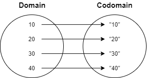

# FP in a nutshell
Functional Programming principles in a nutshell


### Function
A Function in an abstraction to **map** a value from **domain** to another **domain**(codomain).



In the figure we have **Integer** as domain and **String** as codomain, so we have a function from **Integer** to **String** 
and we can write it as `Integer -> String`.

Generalizing we can define a function as `f: A → B` _(from `A` to `B`)_

---

#### Functions in Java
In java we can see function abstraction as a simple interface with a method named `apply` 
that accept only one argument of type `A` and returns an instance of `B`

```java
    interface Function<A, B>{
        B apply(A a);
    }
```


